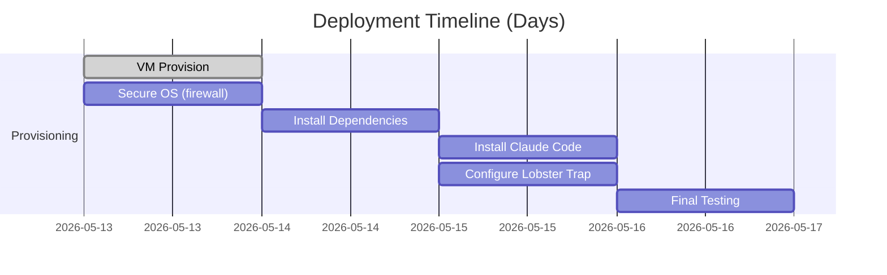

# Executive Summary  
Claude Code’s CLI (terminal UI) can indeed run on a Vultr VM with standard Linux images. According to Anthropic’s docs, Claude Code requires **Ubuntu 20.04+ or Debian 10+ (x64/ARM64) with ≥4 GB RAM**【15†L130-L137】. In practice, community guides report that **2 vCPU/4–8 GB** is the bare minimum, with **8–16 GB** recommended for comfortable multi-file or multi-agent use【15†L130-L137】【32†L95-L103】. We outline a secure Ubuntu 22.04 LTS deployment on Vultr (using a VX1 instance with 2–4 vCPUs and 8–16 GB RAM), install Claude Code and its dependencies, and integrate it with Veea’s Lobster Trap proxy and the GEM² audit loop. The steps include provisioning the VM, hardening (non-root user, SSH keys, UFW firewall, fail2ban, optional Tailscale), installing Claude Code (via Anthropic’s install script or apt repository), and running it. We also cover configuring Lobster Trap as a local proxy (to DPI/scan Claude’s API calls) and hooking Claude’s output/logs into GEM² for auditing. We provide example systemd units for Lobster Trap (proxy) and Claude CLI (if needed), a security checklist, smoke-test steps, cost estimates for Vultr plans, and key links. (For remote development, use `tmux`/`screen` or a web IDE; e.g. community projects offer “VS Code in browser + Claude” setups【40†L389-L398】.)  

## 2. Compatibility Matrix  

| **Platform/Instance**     | **CPU / RAM**  | **Use Case / Notes**                                      |
|--------------------------|---------------|----------------------------------------------------------|
| Ubuntu 22.04 LTS (64-bit)| ≥2 vCPU, ≥4 GB | Officially supported by Claude Code【15†L130-L137】. LTS ensures stability.  |
| Debian 11/12 (64-bit)    | 1 vCPU, ≥4 GB | Supported via apt/dnf install【15†L130-L137】. Low overhead.    |
| Alpine 3.19+ (musl)      | 1 vCPU, 2–4 GB | Supported with extra libs (`libgcc`, `libstdc++`, `ripgrep`)【12†L259-L267】. Ultra-lightweight choice. |
| Vultr VX1-S (dedicated)  | 2 vCPU, 8 GB  | ~\$0.06/hr (~\$43/mo)【42†L168-L172】. Good baseline for single/small projects (block storage variant).  |
| Vultr VX1-S NVMe         | 2 vCPU, 8 GB  | ~\$0.076/hr (~\$55/mo)【42†L168-L172】. Faster NVMe SSD for I/O-heavy tasks.  |
| Vultr VX1-M (dedicated)  | 4 vCPU, 16 GB | ~\$0.12/hr (~\$86/mo)【42†L168-L172】. Comfortable for multi-agent or large repos.  |
| Vultr VX1-M NVMe         | 4 vCPU, 16 GB | ~\$0.153/hr (~\$110/mo)【42†L168-L172】. Ideal for heavier workloads (more memory, CPU). |
| Vultr VX1-L (NVMe)       | 8 vCPU, 32 GB | ~\$0.24/hr (~\$175/mo). For parallel/multi-user CI/CD.         |
| *Vultr HC1 (High-Freq)*  | 1 vCPU, 2 GB  | ~\$0.02–\$0.03/hr (~\$16–\$24/mo). Cheaper bursts but lower clock speed; sufficient for trivial tasks. |
| **Claude Code Requirements (official)** | **x64/ARM64, ≥4 GB RAM** | *See Anthropic docs: Ubuntu≥20.04, Debian≥10【15†L130-L137】.*  |

*Notes:* Claude Code itself is lightweight (its inference is remote on Anthropic’s servers). For large codebases or multiple simultaneous agents, 16 GB+ is recommended【18†L99-L103】. All instances include SSD storage (upgradeable via Vultr Block Storage at \$0.05/GB-month【42†L243-L252】). Outbound bandwidth is pooled (overage \$0.01/GB)【42†L274-L282】.

## 3. Step-by-Step Deployment & Operation Manual  

1. **Create the VM:** In Vultr’s control panel (or CLI), deploy a new instance. Choose *Ubuntu 22.04 LTS (64-bit)* as the OS. For “Instance Type”, select a **VX1-S** (2 vCPU, 8 GB) or larger (see table). Attach an SSH key for login. (Optionally, enable automatic backups or attach a block storage volume for data.) Wait for the VM to initialize.

2. **Initial Login & OS Update:** SSH into the VM as root (or the user you set). Update and upgrade packages:  
   ```bash
   sudo apt update && sudo apt upgrade -y
   ```  
   Install basic tools:  
   ```bash
   sudo apt install -y curl git htop nano ufw fail2ban
   ```

3. **Create Non-root User:** For security, add a sudo-capable user (e.g. `claudeuser`):  
   ```bash
   sudo adduser claudeuser
   sudo usermod -aG sudo claudeuser
   ```  
   Set up your SSH key: from your *local* machine run:  
   ```bash
   ssh-copy-id claudeuser@VPS_IP_ADDRESS
   ```  
   On the server, enforce key-based login and disable password/root SSH:  
   ```bash
   sudo sed -i 's/#PasswordAuthentication yes/PasswordAuthentication no/' /etc/ssh/sshd_config
   sudo sed -i 's/PermitRootLogin yes/PermitRootLogin no/' /etc/ssh/sshd_config
   sudo systemctl restart sshd
   ```

4. **Harden Firewall and Fail2Ban:** Enable UFW firewall:  
   ```bash
   sudo ufw default deny incoming
   sudo ufw default allow outgoing
   sudo ufw allow ssh
   sudo ufw --force enable
   ```  
   (This closes all unused ports; if you later want external access to the Lobster Trap dashboard on 8080, you would `sudo ufw allow 8080`.) Enable Fail2Ban to block brute-force:  
   ```bash
   sudo systemctl enable --now fail2ban
   ```  
   *(Recommended: Install Tailscale for private network tunneling, allowing you to tighten UFW to Tailscale IPs and avoid opening any public ports【32†L172-L181】.)*

5. **Set Up Claude Code:** As `claudeuser`, run the official Anthropic install script (stable channel):  
   ```bash
   curl -fsSL https://claude.ai/install.sh | bash -s stable
   ```  
   This adds Anthropic’s repo and installs the `claude-code` package (or downloads the static binary). Verify installation:  
   ```bash
   claude --version
   ```  
   Log in by running `claude`. If the CLI cannot open a browser (headless VM), use:  
   ```bash
   claude --no-browser
   ```  
   and follow the printed login URL or token flow to authenticate. (You need a paid Claude Code/Enterprise account or a cloud-LLM API key【15†L129-L137】.) Run a quick check:  
   ```bash
   claude doctor
   ```  
   This confirms network access to `api.anthropic.com`, `claude.ai`, etc. (By default Claude requires the listed Anthropic endpoints to be reachable【16†L209-L217】.)

6. **Configure and Start Lobster Trap Proxy:** Install the Lobster Trap DPI proxy. Ensure Go is installed (or fetch a binary):  
   ```bash
   sudo apt install -y golang-go
   go install github.com/veeainc/lobstertrap@latest
   ```  
   (This places the `lobstertrap` binary in your GOPATH, e.g. `~/go/bin/lobstertrap`.) Start Lobster Trap to listen on port 8080 and forward to Claude’s backend API. For example, if using Anthropic’s API:  
   ```bash
   /home/claudeuser/go/bin/lobstertrap serve --listen :8080 --backend https://api.anthropic.com --audit-log lobster.log
   ```  
   *(The `--audit-log lobster.log` option makes Lobster Trap record every intercepted prompt/response to `lobster.log` for auditing.)* Lobster Trap will by default use the default policy (configs/default_policy.yaml) unless you supply your own rules. 

7. **Route Claude through Lobster Trap:** Have Claude Code use the Lobster Trap proxy by setting environment variables (so any `claude` API call goes via Lobster Trap):  
   ```bash
   echo 'export HTTPS_PROXY="http://localhost:8080"' >> ~/.bashrc
   echo 'export HTTP_PROXY="http://localhost:8080"' >> ~/.bashrc
   source ~/.bashrc
   ```  
   Now when you run `claude`, its backend requests (to Anthropic/OpenAI API endpoints) will pass through Lobster Trap. You can verify this by observing `lobster.log` as you interact.

8. **Persistent Storage & Backups:** Attach or configure additional storage if needed. Vultr’s VX1 plans include a NVMe boot disk (e.g. 80 GB) – expand it if your code repos are large. For durability, consider Vultr Block Storage (\$0.05/GB-mo) or snapshot backups (\$0.05/GB)【42†L243-L252】. Docker is optional: to containerize Claude Code, you could use Anthropic’s devcontainer or Dockerfile examples (e.g. from [51]).

9. **Optional Dockerized Approach:** If desired, you can containerize Claude Code CLI. For example, using a Dockerfile (Ubuntu base with Node.js 18+ or the static binary). Then run in a Docker container with `-v /home/claudeuser:/home/claudeuser` for persistence, and `--net=host` or proxy environment to integrate Lobster Trap. This avoids host installs but is more complex; for most use cases, the native install above suffices.

10. **SSH Access & Remote Workflow:** Connect via SSH (`ssh claudeuser@VPS_IP`). For long-lived sessions, use `tmux` or `screen` so the Claude TUI stays running if you disconnect. Alternatively, set up a web-based IDE (e.g. code-server) with Claude Code pre-installed【40†L389-L398】, or use mobile SSH clients (Termius, iSH) to code on the go as demonstrated by others. 

### Mermaid Deployment Timeline  


## 4. systemd Unit Examples  

**Lobster Trap Service:** Create `/etc/systemd/system/lobstertrap.service` as follows (runs proxy on boot):  
```ini
[Unit]
Description=Lobster Trap DPI Proxy for Claude
After=network-online.target

[Service]
User=claudeuser
ExecStart=/home/claudeuser/go/bin/lobstertrap serve --listen :8080 --backend https://api.anthropic.com --audit-log /home/claudeuser/lobster.log
Restart=on-failure

[Install]
WantedBy=multi-user.target
```  
Enable and start:  
```bash
sudo systemctl daemon-reload
sudo systemctl enable --now lobstertrap.service
```

**Claude Code CLI Service (optional):** If you want Claude to auto-start (though it is interactive), you can create `/etc/systemd/system/claude.service`:  
```ini
[Unit]
Description=Claude Code CLI Service
After=network-online.target

[Service]
User=claudeuser
WorkingDirectory=/home/claudeuser
ExecStart=/usr/local/bin/claude --no-browser
StandardInput=tty
StandardOutput=journal
Restart=on-failure

[Install]
WantedBy=multi-user.target
```  
Enable/start similarly. In practice, one usually launches `claude` manually or in a tmux session.

## 5. Security Checklist  

- **Non-root sudo user:** Do *not* run Claude or Lobster as root【32†L142-L150】. Use a dedicated `claudeuser`.  
- **SSH keys only:** Disable password login and root login in SSH【32†L149-L158】; use SSH keys (ed25519) with strong passphrases.  
- **UFW firewall:** Default deny incoming, allow only SSH (and Lobster Trap port if needed)【32†L160-L164】.  
- **Fail2Ban:** Enable to auto-block repeated login attempts【32†L167-L171】.  
- **Tailscale/VPN:** (Recommended) Use Tailscale or VPN so SSH port is not exposed publicly【32†L172-L181】.  
- **Least privilege:** Run services as non-root. Store Claude and Lobster binaries in secure directories (e.g. `/usr/local/bin` or user’s home).  
- **Key/secret management:** Do not embed API tokens in scripts; use environment variables or a secrets manager. Anthropic API keys should be protected (Claude CLI uses OAuth/webflow).  
- **Firewall egress:** If desired, restrict outbound to only Anthropic/OpenAI endpoints (see [16] for domains). Lobster Trap will handle inspection, but you may also block any other outbound ports.  
- **Regular updates:** Keep OS and Claude Code updated (stable channel)【47†L514-L522】. Reboot or restart services after updates.  
- **Backups:** Snapshot the VM before major changes (disk, configs). Vault or encrypt backups of Claude’s `~/.claude` if storing logs.  

## 6. Testing & Smoke Tests  

- **CLI health:** Run `claude doctor` to verify installation and network connectivity. `claude --version` should output the installed version.  
- **Basic conversation:** Start `claude` and ask a trivial question (e.g. “Hello”). Ensure it responds without errors.  
- **Log generation:** Perform a session and check `~/.claude/<workspace>/transcript.json` exists and contains the prompts/responses.  
- **Lobster Trap check:** Inspect `lobster.log` while conversing through Claude. The log should show each prompt and Lobster’s policy decision. Use `lobstertrap inspect` on a test prompt (e.g. a malicious curl command) to see if it catches it. Run `lobstertrap test` to verify the default policy【38†L358-L364】.  
- **Firewall:** Verify `ufw status` shows SSH (and/or 8080) open, others closed. From another host, attempt an unauthorized port (should be blocked).  
- **Service status:** Check `systemctl status lobstertrap` (and `claude` if used as service).  
- **Resource usage:** Monitor `htop` or `free -m` while Claude is running. Ensure no excessive memory swapping. If needed, increase swap or instance size.  
- **Remote access:** Disconnect SSH and reconnect; verify `claude` session continues (using tmux/screen). Test mobile SSH if applicable.  
- **Connectivity:** Try `curl https://api.anthropic.com` to ensure no DNS/proxy issues. Check SSL certs if in a restrictive network (Anthropic uses valid certs).  
- **GEM² audit loop:** (If GEM² tools are available) feed a sample conversation or `lobster.log` into GEM²’s audit CLI (`gem2-lfs` or similar). Verify the output includes a truth/grounding score and any flagged intents (F:A→B|P contract checks).

## 7. Troubleshooting Tips  

- **`claude` not found:** Ensure the `claude` binary is in `PATH` (e.g. `/usr/local/bin/claude`). Re-login or source your profile.  
- **Authentication hangs:** If `claude` never prompts or stalls at login, try `claude login --no-browser` to get a URL and code manually. Check that outbound HTTPS is allowed.  
- **Errors installing Claude:** If `install.sh` fails, try the apt method:  
  ```bash
  sudo curl -fsSL https://downloads.claude.ai/keys/claude-code.asc -o /etc/apt/keyrings/claude-code.asc
  echo "deb [signed-by=/etc/apt/keyrings/claude-code.asc] https://downloads.claude.ai/claude-code/apt/stable stable main" \
       | sudo tee /etc/apt/sources.list.d/claude-code.list
  sudo apt update && sudo apt install claude-code
  ```  
- **No responses / proxy issues:** If Claude gives network errors, verify `HTTPS_PROXY` is set correctly and that Lobster Trap is running. Use `curl -x localhost:8080 https://api.anthropic.com` to test the proxy path.  
- **Lobster Trap failing:** Check `journalctl -u lobstertrap`. Ensure no port conflicts on 8080. Try `lobstertrap version` to confirm installation. If built from source, use `go install` again.  
- **High resource usage:** Monitor CPU/memory. If Claude sessions or Lobster cause spikes, scale up the VM (more vCPUs or RAM). Claude itself is light, but large context or multiple sessions can grow usage.  
- **Permissions denied:** If running scripts (e.g. lobstertrap) gives permission errors, check file ownership and SELinux/AppArmor rules. Running Lobster Trap as `claudeuser` should avoid permission issues.

## 8. Cost Estimates  

- **Instance:** A 2 vCPU/8 GB Vultr VX1 (block storage) is about **\$0.06/hr (~\$43/mo)**【42†L168-L172】. An 8 GB NVMe variant is **\$0.076/hr (~\$55/mo)**【42†L168-L172】. Upgrading to 4 vCPU/16 GB roughly **\$0.12–0.15/hr (\$86–110/mo)**.  
- **Storage:** Base NVMe disk (e.g. 80 GB) is included. Additional Block Storage costs **\$0.05 per GB-month**【42†L243-L252】. Snapshots are **\$0.05/GB**.  
- **Bandwidth:** Vultr instances include pooled bandwidth (e.g. 5–6 TB). Outbound beyond allowance is **\$0.01/GB**【42†L274-L282】; inbound is free. (AI usage is typically chat text, so bandwidth is negligible.)  
- **Backups/DDoS:** Automated backups add 20% of base cost (e.g. a \$86/mo instance → +\$17/mo)【42†L308-L311】. DDoS protection is available (~\$10/mo per instance) for production use.  

*(Prices as of 2026; see Vultr pricing for current rates.)*  

## 9. Sources and Further Reading  

- **Claude Code Official Docs:** Quickstart and Advanced Setup (system requirements, install methods)【15†L130-L137】【47†L505-L513】.  
- **Claude Code Community Guides:** A detailed VPS setup (security, tmux, Tailscale)【32†L95-L103】【32†L142-L151】. Reddit confirms Claude works on Vultr/Hetzner without IP blocking【11†L122-L130】.  
- **Vultr Docs & Blogs:** VX1 plan details and pricing【42†L168-L172】【42†L243-L252】. Vultr products and OS images (Ubuntu 22.04 LTS) are listed on the Vultr site.  
- **Lobster Trap:** GitHub repo (proxy usage, policy engine)【38†L269-L278】【38†L323-L331】.  
- **GEM² Audit:** (Internal docs) GEM² attaches truth/risk scores to actions (F:A→B|P contracts) as described in the GEM² specification and audit guides.  
- **Network Requirements:** Anthropic endpoints to whitelist (claude.ai, api.anthropic.com, etc.)【16†L209-L217】.  

