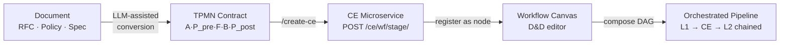

# Vision — Document-to-Workflow Canvas Pipeline

**Status:** Vision document. Captures David's strategic direction for GEM²-Crafter beyond the current CE wrapper system.
**Updated:** 2026-05-17 (revised — Stages 3+4 SHIPPED via WP-AO-37 + WP-AO-38; sequence section rewritten)
**Owner:** David Seo (GEM².AI)
**Captures conversation:** "document → TPMN Contract → working Microservice (opensource LLM) → workflow creation by D&D in Canvas"

---

## 1. The four-stage pipeline

```
┌──────────────┐    ┌──────────────┐    ┌──────────────────┐    ┌────────────────────┐
│   Stage 1    │    │   Stage 2    │    │     Stage 3      │    │      Stage 4       │
│              │    │              │    │                  │    │                    │
│  Free-form   │───▶│  TPMN-format │───▶│  Live CE micro-  │───▶│  Drag-and-drop     │
│  document    │    │  contract    │    │  service         │    │  workflow canvas   │
│  (RFC, spec, │    │  (5-block:   │    │  (POST /ce/.../  │    │  (DAG of CEs with  │
│   policy)    │    │  A·P_pre·F·  │    │   backed by      │    │   L1/L2 audit on   │
│              │    │  B·P_post)   │    │   open-source    │    │   each edge)       │
│              │    │              │    │   Vultr LLM)     │    │                    │
└──────────────┘    └──────────────┘    └──────────────────┘    └────────────────────┘
       ▲                   ▲                     ▲                        ▲
       │                   │                     │                        │
   manual upload     /create-ce parses     stateless wrapper       visual editor
   (judge/expert    (today)              calls Vultr LLM        composes pipelines
    starting point) ── manual today ──   (shipped WP-AO-26)      (NEXT MILESTONE)
                       LLM-assisted
                       in Stage 1 vision
```



**One-line goal per stage:**
1. *Stage 1*: turn arbitrary domain knowledge into a contract a CE can run.
2. *Stage 2*: turn a contract into a live, callable API in seconds.
3. *Stage 3*: let a domain expert chain CEs visually without writing code.
4. *Stage 4*: execute the canvas-composed pipeline with epistemic gates between every node.

---

## 2. What exists today (Stage 2 SHIPPED)

| Component | Status | Location |
|-----------|--------|----------|
| TPMN contract parser (5-block format) | ✅ Shipped | `console/ce_contract_parser.go` |
| `/create-ce` skill | ✅ Shipped | `console/ce_generator.go` |
| CE registry (per-CE JSON spec) | ✅ Shipped | `.gem-squared/ce-registry/{wf}/{stage}.json` |
| Live CE invocation endpoint | ✅ Shipped | `POST /ce/{wf}/{stage}/` |
| Sample input auto-generation (Vultr LLM at create time) | ✅ Shipped | `generateSampleInput` |
| One-click viewer with prefill | ✅ Shipped | `console/static/ce-viewer.html` + `/ce-viewer?api=…&sample=…&key=…` |
| LLM-agnostic doctrine (skills embedded compile-time) | ✅ Shipped | `crafter-common-skills/` via `//go:embed` |
| Live deployment | ✅ Shipped | `https://ai-olympic.gemsquared.ai/` (Vultr VPS) |

**What does NOT exist yet:** Stage 1 (doc→TPMN converter) — this is the new frontier.

**SHIPPED after the initial vision-doc write (2026-05-17 same day):**
- Stage 3 (canvas editor) — WP-AO-37 vendored Drawflow + wrote `Docs/workflow-json-spec.md`; WP-AO-38 built the production canvas (`console/static/workflow-canvas.{html,css,js}`, 1.3k LOC) integrated as the third Crafter tab.
- Stage 4 (L1/L2 audit on every edge) — WP-AO-38 backend `console/workflow_runner.go` brackets every CE invocation with P-check before + O-check after via the WP-AO-25 audit-gate SaaS proxy. SSE trace events stream per-phase verdicts + scores + reasons to the canvas overlay. Truth-log persisted at `.gem-squared/truth-logs/{run_id}.jsonl`.

See Sections 4 and 5 below for the original design notes (kept for historical context). Sections 7 and 8 have been revised to reflect the new state.

---

## 3. Stage 1 — Document → TPMN Contract

**Goal.** A user uploads a free-form document (PDF, markdown spec, policy RFC, requirements doc). The system reads it, identifies the contract candidates inside, and produces a draft TPMN contract in the 5-block format that `/create-ce` already understands.

**Design approach.**
- **Input:** any text document. Initial scope: markdown + plain text. PDF deferred.
- **Engine:** LLM-assisted extraction. Wolfi (Gemini) calls a structured prompt that asks the model to identify: (a) the input shape A, (b) preconditions on A, (c) the processing logic F as numbered steps, (d) the output shape B, (e) postconditions on B. Output is constrained to a JSON schema mirroring the 5-block layout.
- **Validation gate:** the extracted draft is round-tripped through `parseContractFile` and `validateCESpec`. If validation fails, the LLM is asked to fix the specific failing block (targeted re-prompt), bounded to N=3 retries before surfacing to the user.
- **Fallback:** if validation never passes, present the draft side-by-side with the original document and let the user hand-edit. The user can always author manually as today.
- **Reusable artifact:** the validated contract markdown is saved to `uploaded_files/` so existing `/create-ce` auto-detect can pick it up — Stage 1 hands off to Stage 2 via the same path that manual uploads use.

**Open questions for Stage 1:**
- Whether to support multi-contract documents (one doc yielding N CEs). Plausible for policy bundles. Defer until single-contract works end-to-end.
- Whether to use a domain-aware extraction prompt (e.g., insurance vs. lending presets). Defer — generic prompt first.
- Privacy stance on document content sent to the LLM. The Vultr inference path is already in production; same privacy posture applies.

---

## 4. Stage 3 — CE → Workflow Canvas (SHIPPED — see WP-AO-37 + 38 archives)

**Reality (post-2026-05-17):** built per the design below, with these concrete decisions made during implementation:
- Frontend lib: **Drawflow v0.0.60** (MIT-licensed, vendored at `console/static/vendor/drawflow/`). Picked over react-flow because the rest of GEM²-Crafter is a single Go binary with no build step.
- `workflow.json` schema: v1.0 documented at `Docs/workflow-json-spec.md` — authoritative for both canvas and runner.
- Node = CE registry entry. Edge type-compatibility check runs canvas-side; mismatched schemas show red and refuse to save.
- Execution endpoint LIVE: `POST /api/workflow/run` + `GET /api/workflow/run/{id}/stream` (SSE).
- Integrated as the 3rd Crafter tab alongside Crafter + Explorer.

**Original design notes (kept for context):**


**Goal.** A user opens a canvas, sees the CE registry as a palette of draggable nodes, drops several onto the canvas, draws edges between them, and runs the resulting DAG end-to-end.

**Design approach.**
- **Frontend:** browser-based canvas. Web (HTML + JS) — no Electron — because the rest of GEM²-Crafter is a single Go binary serving static assets. Candidate libs: `react-flow`, `mermaid` (read-only), `vanilla-canvas + custom drag layer`. Prefer something embeddable without a build step to keep the Go binary self-contained — likely a single-file JS bundle.
- **Node model:** each node = one CE registry entry. Node title = contract title; node ports = A schema (input port) + B schema (output port). Visible metadata: model name, L1/L2 trust gates, P_pre count, P_post count.
- **Edge model:** edge connects output port of CE_i to input port of CE_j. The edge represents data flow A→B. **Type compatibility check** runs in the canvas: if `CE_i.B` schema doesn't structurally match `CE_j.A` schema, the edge renders red and cannot be saved.
- **Workflow artifact:** the canvas saves to `workflow.json` per project:
  ```json
  {
    "workflow_slug": "claims-end-to-end",
    "nodes": [{"id":"n1", "ce_slug":"insurance-claims-workflow/payout-calculation"}, ...],
    "edges": [{"from":"n1.output", "to":"n2.input"}, ...],
    "entry_node": "n1",
    "exit_node": "n3"
  }
  ```
- **Execution endpoint:** `POST /api/workflow/run` reads `workflow.json`, traverses the DAG topologically, calls each CE's `/ce/{wf}/{stage}/` endpoint with the predecessor's output, brackets each call with L1 P-check (input validation) and L2 O-check (output validation) — see Stage 4.
- **Live introspection:** during execution the canvas highlights the currently-running node, shows L1/L2 verdicts inline, and pauses on DENY/FAILURE for user review.

**Open questions for Stage 3:**
- Parallel branches vs. linear chains. v1: linear only. v2: fan-out/fan-in.
- How to surface CE registry on the canvas — sidebar list, search, drag-from-list. Probably sidebar with type-ahead search.
- Multi-workflow project layout. One project = many workflows? Likely yes; default one-to-one for the demo.
- Versioning. A workflow references CEs by slug; if a CE is rebuilt with different schema, downstream edges may break. Need an `expected_schema_hash` per edge so canvas can flag mismatches on load.

---

## 5. Stage 4 — Pipeline Execution with L1/L2 Audit Gates (SHIPPED — see WP-AO-38)

**Reality (post-2026-05-17):** built per the design below in `console/workflow_runner.go`. Key concrete details:
- `RunWorkflow(ctx, wf, input, runID, trace)` exported function — topo-sorts the DAG (Kahn's algorithm with cycle detection), then per-node executes the L1 P-check → CE-invoke → L2 O-check sequence.
- Truth-log written line-by-line to `.gem-squared/truth-logs/{run_id}.jsonl` — one entry per L1/L2/exec event with timestamp, verdict, score, reasons, latency_ms.
- SSE event shape: `{phase: "l1"|"exec"|"l2"|"start"|"end"|"halt", node_id, verdict?, score?, reasons?, latency_ms, error?}`.
- L1 DENY → halt at this node; L2 FAILURE → halt before passing data to the next node. Bounded retry policy via the spec.

**Original design notes (kept for context):**


**Goal.** Every edge in a workflow runs through a GEM² truth-filter pair: L1 P-check on the input side, L2 O-check on the output side. The canvas surfaces every verdict; users can stop, retry, or accept partial results.

**Design approach.**
- **L1 P-check:** before calling CE_i, the orchestrator sends `{contract: CE_i.contract, input: data_from_predecessor}` to `https://gem2-tpmn-checker.fly.dev/api/v1/truth-filter` mode=p-check. Verdict `ALLOW|DENY` plus per-rule reasons. DENY halts execution at this node.
- **L2 O-check:** after CE_i returns, send `{contract: CE_i.contract, output: ce_response}` to the same SaaS endpoint, mode=o-check. Verdict `SUCCESS|FAILURE`. FAILURE halts execution before passing data to CE_{i+1}.
- **Trust gates per CE:** each contract declares `trust_gate_L1` and `trust_gate_L2` in its Circus Executor block. These thresholds (0-100) are used by the canvas to color-code verdicts: green ≥ gate, amber 50-gate, red < 50.
- **Failure handling:**
  - L1 DENY → surface the rule violation to the user; offer to fix input upstream or skip this node.
  - L2 FAILURE → surface the postcondition violation; offer retry (LLM may produce different output) or accept-with-warning.
  - Both audit calls have a default budget of N=2 retries before halting the workflow.
- **Audit log:** every L1/L2 call is persisted to `.gem-squared/truth-logs/{workflow_run_id}.jsonl` — judges and regulators can replay the chain of trust.

**Open questions for Stage 4:**
- L1/L2 latency overhead (each call ~500-800ms today). For long chains, audit cost dominates. Optimization: batch-mode audit endpoint that takes the whole pipeline trace and audits offline. Defer until baseline measured.
- Whether to make L1/L2 optional per workflow (some users may want raw CE-chain without audit). Default: audit always on; offer "skip audit" only with explicit override.

---

## 6. The CE atomicity invariant

**Each CE is one unit. Workflows compose units, they do not modify them.**

This invariant has three consequences:

1. A workflow cannot mutate a CE's contract. If the contract needs to change, the user goes back to Stage 2 (`/create-ce` with `force=true`) and produces a new revision.
2. CE inputs/outputs are pure values. No CE may write to a shared mutable state visible to other CEs. Data flow is exclusively through edges.
3. CE side effects are scoped to the LLM call. No filesystem writes, no DB writes, no external HTTP calls from within F. (If a contract needs external data, it must arrive via `reference_data` on the input — the orchestrator is responsible for populating that, not the CE.)

This invariant is what makes the canvas tractable: nodes are stateless functions, edges are typed data flow, and the only "side effect" is the LLM call inside each F block.

---

## 7. What this WP series did and did NOT do (revised 2026-05-17)

**Done in this initial WP cycle (WP-AO-31..35):**
- Vision doc captured (this file)
- Orchestrator hijack fixed (WP-AO-32)
- Collision-path viewer button (WP-AO-33)
- Chat persistence + session auto-naming (WP-AO-34)
- Canonical pipeline enforcement + /deploy-work skill (WP-AO-35)

**Done in the parallel Stage-3 lane (WP-AO-37..38, archived SUCCESS):**
- Stage 3 canvas editor — Drawflow vendored, schema authored, production canvas + DAG runner shipped.
- Stage 4 L1/L2 auto-bracketing — `workflow_runner.go` audits every edge.
- This is what Section 8 below originally pegged as a 5-7 WP effort — shipped in 2 WPs (10 units total).

**Still NOT done:**
- Stage 1 (doc → TPMN converter) — the new frontier.
- Per-CE smoke-test automation inside `/deploy-work` for CE-only flows (currently re-emits viewer URL; doesn't auto-curl).
- WP-AO-26..35 archival via `/archive-work` (work-plan files still in `.gem-squared/work-plan/`, not in `archive/`).

---

## 8. Sequence after this doc (revised 2026-05-17)

1. ~~**WP-AO-32** — fix the orchestrator-hijack bug.~~ **DONE** (committed).
2. ~~**Hardening** — collision-path viewer button.~~ **DONE** via WP-AO-33.
3. ~~**Stage 3 WP series — canvas editor.**~~ **DONE** via WP-AO-37 + WP-AO-38 (parallel-session lane).
4. ~~**Stage 4 hardening — auto-bracket L1/L2.**~~ **DONE** in WP-AO-38 `workflow_runner.go`.
5. **Stage 1 WP series — doc → TPMN converter** (the new frontier). Likely 3-4 WPs:
   - WP candidate: LLM-assisted contract extraction prompt + validation loop
   - WP candidate: multi-contract document handling (one doc → N CEs)
   - WP candidate: UI integration (upload PDF/markdown → preview → "Create Contract" button)
   - WP candidate: domain-presets (insurance / lending / claims) for accuracy
6. **Canvas + CE lifecycle gaps** — workflow versioning (CE schema hash per edge), workflow.json import/export, run-history page.
7. **Production hardening** — truth-log retention policy, audit-cost reporting, batched audit mode for long chains.

This sequence is intent, not commitment. Each WP is planned individually when its turn comes.

---

## 9. References

- WP-AO-26: CE generator + universal handler (Stage 2 base)
- WP-AO-30: CE viewer + URL routing (Stage 2 polish)
- WP-AO-31: viewer architecture pivot — single static viewer page with URL params
- WP-AO-32: orchestrator-hijack fix (precondition for reliable demo flow)
- WP-AO-25: L1/L2 audit gate SaaS proxy (Stage 4 primitive)
- CLAUDE.md: project identity, LLM-agnostic doctrine, GEM² governance gate model
- Docs/contract-authoring-guide.md: the 5-block TPMN format spec (Stage 1's output target)
- David's verbal vision (2026-05-17 turn): the source of truth for this doc

*— David Seo, GEM².AI*
